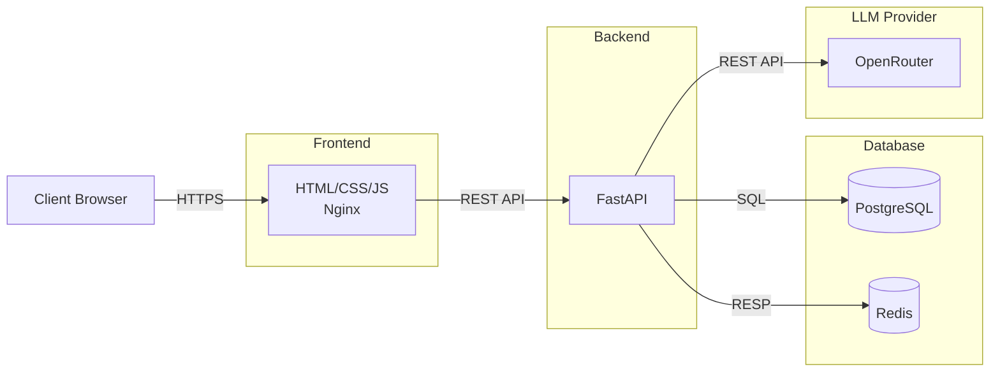

# Architecture

## System components

- **Frontend** — HTML/CSS/JS, Nginx
- **Backend** — FastAPI
- **Database** — PostgreSQL, Redis
- **LLM Provider** — OpenRouter

## Component interaction

```mermaid
flowchart LR
    U[Client Browser]

    subgraph Frontend
        FE[HTML/CSS/JS<br>Nginx]
    end

    subgraph Backend
        BE[FastAPI]
    end

    subgraph Database
        PG[(PostgreSQL)]
        RE[(Redis)]
    end

    subgraph LLM[LLM Provider]
        OR[OpenRouter]
    end

    U -->|HTTPS| FE
    FE -->|REST API| BE
    BE -->|REST API| OR
    BE -->|SQL| PG
    BE -->|RESP| RE
```
