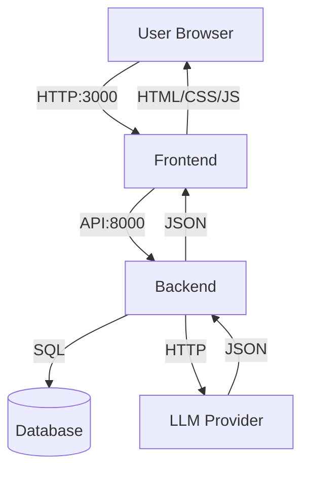

# Architecture

## System components

- **Frontend** — HTML/CSS/JS, Nginx
- **Backend** — FastAPI
- **Database** — PostgreSQL
- **LLM Provider** — OpenRouter

## Component interaction

```mermaid
graph TD
    User[User Browser] -->|HTTP:3000| FE[Frontend]
    FE -->|API:8000| BE[Backend]
    BE -->|SQL| DB[(Database)]
    BE -->|HTTP| LLM[LLM Provider]
    LLM -->|JSON| BE
    BE -->|JSON| FE
    FE -->|HTML/CSS/JS| User
```
