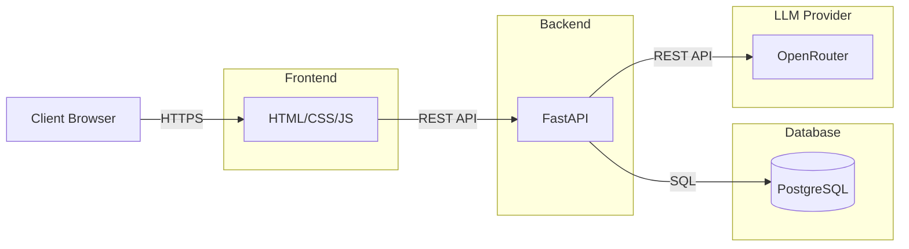

# Architecture

## System components

- **Frontend** — HTML/CSS/JS
- **Backend** — FastAPI
- **Database** — PostgreSQL
- **LLM Provider** — OpenRouter

## Component interaction

1. User opens browser
2. Frontend:
    - serves static files (HTTPS)
    - calls Backend (REST API)
3. Backend:
    - Reads/writes PostgreSQL (SQL)
    - Calls OpenRouter for AI generation (REST API)
4. Response returns to Frontend
5. User sees result
